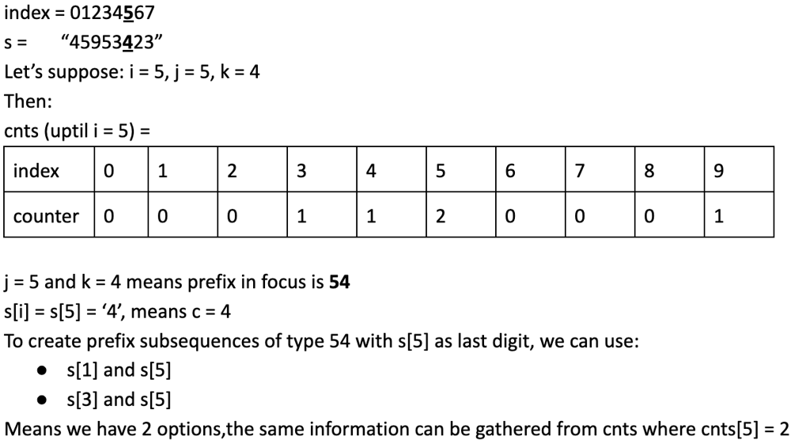

[C++, Java, Python3] Counting Prefixes and Suffixes

Anujot Singh
15409
Nov 26, 2022
C++
Java
Python3
Intuition
To create a 5 digit palindrome we do not need to care about the middle element. We just need to find subsequence of pattern XY_YX. Calculate number of subsequences of type XY and subsequences of type YX around any given point i and multiply them to find number of subsequences of type XY_YX. Since string only has digits, the time complexity will be 100*n.

Approach
We will be maintaing the counts of digit in the list cnts
Keep 2 arrays pre and suf to store the number of prefixes of type XY and suffixes of type YX. pre[i-1][1][2] means prefixes of type 12 before index i. Similarly suf[i+1][1][2] means suffixes of type 21 after index i
Remember given string is made of digits that is 0123456789. That's a total of 10 unique characters
Once we have calculated the prefix and suffix lists we just need to multiply pre[i - 1][j][k] with suf[i + 1][j][k] to find number of palindromic subsequences
    for (int i = 0; i < n; i++) {
        int c = s[i] - '0';
        if (i) {
            for (int j = 0; j < 10; j++)
                for (int k = 0; k < 10; k++) {
                    pre[i][j][k] = pre[i - 1][j][k];
                    if (k == c) pre[i][j][k] += cnts[j];
                }
        }
        cnts[c]++;
    }
Explanation of above code:
Use if (i) to not step outside of array limits when accessing pre[i-1]
Let's say j = 5, k = 4 and c = 4 which means we are looking at prefix 54. pre[i][j][k] = pre[i - 1][j][k] will carry forward previous count of prefixes. Since k == c means the current character(s[i]) matches with last digit of prefix. To find total number of possibilites of prefixes of type 54 we need to know how many 5 exist before current index. This information is stored in cnts[5]. So we add cnts[5] to pre[i][5][4].
Screen Shot 2022-11-27 at 10.13.27 AM.png

Complexity
Time complexity: O(n)

Space complexity: O(n)

Code
Python 3

def countPalindromes(self, s: str) -> int:
    mod, n, ans = 10 ** 9 + 7, len(s), 0
    pre, cnts = [[[0] * 10 for _ in range(10)] for _ in range(n)], [0] * 10
    for i in range(n):
        c = ord(s[i]) - ord('0')
        if i:
            for j in range(10):
                for k in range(10):
                    pre[i][j][k] = pre[i - 1][j][k] 
                    if k == c: pre[i][j][k] += cnts[j]
        cnts[c] += 1
    suf, cnts = [[[0] * 10 for _ in range(10)] for _ in range(n)], [0] * 10
    for i in range(n - 1, -1, -1):
        c = ord(s[i]) - ord('0')
        if i < n - 1:
            for j in range(10):
                for k in range(10):
                    suf[i][j][k] = suf[i + 1][j][k]
                    if k == c: suf[i][j][k] += cnts[j]
        cnts[c] += 1
    for i in range(2, n - 2):
        for j in range(10):
            for k in range(10):
                ans += pre[i - 1][j][k] * suf[i + 1][j][k]
    return ans % mod
C++

int pre[10000][10][10], suf[10000][10][10], cnts[10] = {};
int countPalindromes(string s) {
    int mod = 1e9 + 7, n = s.size(), ans = 0;
    for (int i = 0; i < n; i++) {
        int c = s[i] - '0';
        if (i)
            for (int j = 0; j < 10; j++)
                for (int k = 0; k < 10; k++) {
                    pre[i][j][k] = pre[i - 1][j][k];
                    if (k == c) pre[i][j][k] += cnts[j];
                }
        cnts[c]++;
    }
    memset(cnts, 0, sizeof(cnts));
    for (int i = n - 1; i >= 0; i--) {
        int c = s[i] - '0';
        if (i < n - 1)
            for (int j = 0; j < 10; j++)
                for (int k = 0; k < 10; k++) {
                    suf[i][j][k] = suf[i + 1][j][k];
                    if (k == c) suf[i][j][k] += cnts[j];
                }
        cnts[c]++;
    }
    for (int i = 2; i < n - 2; i++)
        for (int j = 0; j < 10; j++)
            for (int k = 0; k < 10; k++)
                ans = (ans + 1LL * pre[i - 1][j][k] * suf[i + 1][j][k]) % mod;
    return ans;
}
Java

public int countPalindromes(String s) {
    int mod = 1000_000_007, n = s.length(), ans = 0, cnts[] = new int[10],
    pre[][][] = new int[n][10][10], suf[][][] = new int[n][10][10];
    for (int i = 0; i < n; i++) {
        int c = s.charAt(i) - '0';
        if (i > 0)
            for (int j = 0; j < 10; j++)
                for (int k = 0; k < 10; k++) {
                    pre[i][j][k] = pre[i - 1][j][k];
                    if (k == c) pre[i][j][k] += cnts[j];
                }
        cnts[c]++;
    }
    Arrays.fill(cnts, 0);
    for (int i = n - 1; i >= 0; i--) {
        int c = s.charAt(i) - '0';
        if (i < n - 1)
            for (int j = 0; j < 10; j++)
                for (int k = 0; k < 10; k++) {
                    suf[i][j][k] = suf[i + 1][j][k];
                    if (k == c) suf[i][j][k] += cnts[j];
                }
        cnts[c]++;
    }
    for (int i = 2; i < n - 2; i++)
        for (int j = 0; j < 10; j++)
            for (int k = 0; k < 10; k++)
                ans = (int)((ans + 1L * pre[i - 1][j][k] * suf[i + 1][j][k]) % mod);
    return ans;
}
Next
4D - DP || C++ || Top Down
Comments (22)

Sort by:Best
Type comment here...
Comment

LAKSHYA AGRAWAL
100 Days Badge 2023
Sep 28, 2023
                if (k == c) suf[i][j][k] += cnts[j];
My small brain still cant understand this

11
Hide Replies
Reply

伟 袁
50 Days Badge 2023
Mar 27, 2024
the count of XY at index i, equals the count of XY at i-1, plus the count of X in [0,i-1].

5
Reply
Hide

Sumurth Dixit
Binary Search I
Nov 14, 2023
 if (k == c) suf[i][j][k] += cnts[j];
since we need to look at the suffix, shouldn't we be considering writing if(j == c) suf[i][j][k] += cnts[k];?

4
Show 1 Replies
Reply

Himanshu Rajput
Dec 08, 2022
ohhh 3d dp for prefix and suffix calculation
Modified Python solution Easy to read following DRY rule

def countPalindromes(self, s: str) -> int:
    mod = 10 ** 9 + 7
    n = len(s)
    
    def findPrefix(s):
        cntArr = [0]*10
        dp = [[[0]*10 for _ in range(10)] for _ in range(n)]
        for i in range(n) :
            num = int(s[i])
            if i-1 >= 0 :
                for x in range(10):
                    for y in range(10):
                        dp[i][x][y] = dp[i-1][x][y]
                        # if curr num is y then we get new xy combo
                        if y == num : 
                            dp[i][x][y] += cntArr[x]
            cntArr[num] += 1
        return dp
    
    pre = findPrefix(s)
    suff = findPrefix(s[::-1])[::-1]   
    # suff[i][x][y] is actually suff[i][y][x] here because of reverse string prefix finding
    
    res = 0
    for i in range(2,n-2):
        for x in range(10):
            for y in range(10):
                res = (res + pre[i-1][x][y] * suff[i+1][x][y]) % mod
    return res
4
Show 2 Replies
Reply

alpha_gigachad
Annual Badge 2022
Nov 27, 2022
Very beautiful, very powerful

4
Show 1 Replies
Reply

Tatiana
Annual Badge 2024
Nov 26, 2022
Thanks for the excellent explanation!

4
Reply

Devansh Chowdhury
100 Days Badge 2022
Dec 09, 2022
Great logic and visually explained. Hats off.Repect++

2
Reply

Saijayavinoth T V S
100 Days Badge 2022
Dec 05, 2022
Your first 5 lines....were good enough to feed the solution into the readers' mind...good job

2
Reply

Kartik Bhardwaj
50 Days Badge 2024
Apr 11, 2025
Thank you❤️

0
Reply

Kumar Saurav
100 Days Badge 2022
Jan 17, 2025
perfecto solutiono!!

0
Reply

this_is_destiny
50 Days Badge 2024
Apr 06, 2024
how to come up with this in 40mins lol

0
Reply

